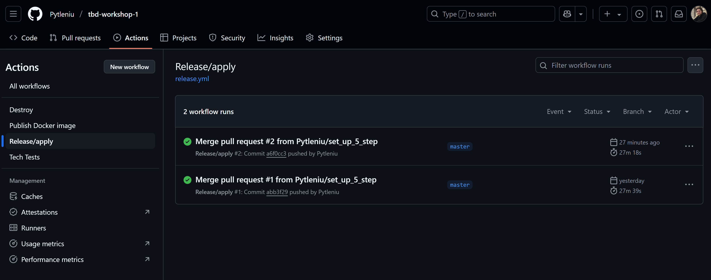
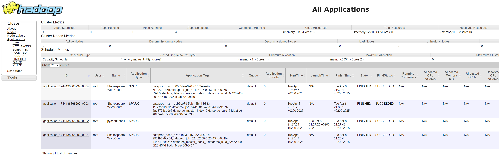
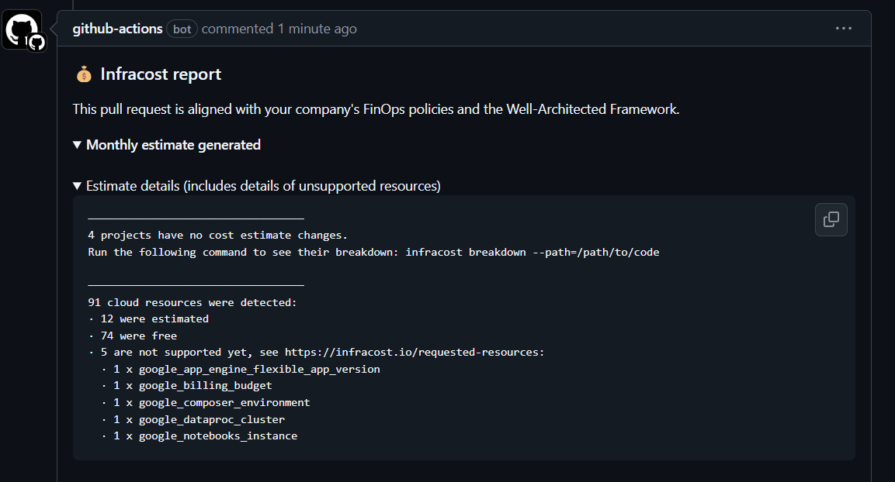
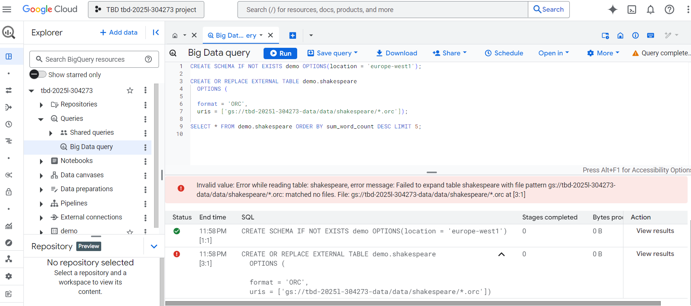

IMPORTANT ❗ ❗ ❗ Please remember to destroy all the resources after each work session. You can recreate infrastructure by creating new PR and merging it to master.


1. Authors:

   ***Group number: 16***
    - Michał Kopeć
    - Wiktor Pytlewski


   ***Link to forked repo: [https://github.com/Pytleniu/tbd-workshop-1](https://github.com/Pytleniu/tbd-workshop-1)***

2. Follow all steps in README.md.

3. In boostrap/variables.tf add your emails to variable "budget_channels".

4. From avaialble Github Actions select and run destroy on main branch.

5. Create new git branch and:
    1. Modify tasks-phase1.md file.

    2. Create PR from this branch to **YOUR** master and merge it to make new release.

    


6. Analyze terraform code. Play with terraform plan, terraform graph to investigate different modules.

After executing the command: `terraform plan -var-file="env\project.tfvars" -out="terraform_plan"`, a plan was generated for applying Terraform. The output shows the planned actions Terraform will perform, including which modules will be created, replaced, or updated. Additionally, the command provides details about which images and resources have been modified since the last application, as well as highlighting deprecated variables and resources.

By executing the command: `terraform graph -module-depth=1 > data-pipeline-graph.dot`, we generated a graph of the entire architecture and saved it into a file. Afterward, we isolated the part describing the Data Pipeline Module and created a diagram based on it.

**Data Pipeline Module** handles the creation and setup of Google Cloud Storage (GCS) buckets that are used to store scripts for a data pipeline powered by Apache Airflow. The module creates two separate buckets: one for storing the code for a Spark job (`tbd-code-bucket`), and another for storing pipeline data (`tbd-data-bucket`). Additionally, the module configures and sets up the necessary IAM to assign appropriate permissions to service accounts, along with creating a GCS bucket object for the code bucket.

The following diagram illustrates the relationships and dependencies between the resources created by this module:


**Resources:**
- `google_storage_bucket.tbd-code-bucket`: This GCS bucket stores the code related to the data pipeline, specifically for the Spark job.
- `google_storage_bucket.tbd-data-bucket`: A second GCS bucket that is used for storing the pipeline's data.
- `google_storage_bucket_iam_member.tbd-data-bucket-iam-editor`: This IAM resource grants the specified service account (`tbd-composer-sa`) the `storage.objectEditor` role on the `tbd-data-bucket`, allowing it to both read and write to the bucket.
- `google_storage_bucket_iam_member.tbd-code-bucket-iam-viewer`: This IAM resource grants the specified service account (`tbd-composer-sa`) the `storage.objectViewer` role on the `tbd-code-bucket`, providing it read-only access to the bucket.
- `google_storage_bucket_object.dag-code`: This resource stores a file in the `tbd-code-bucket` that contains the DAG code for Apache Airflow. The file will be used in the pipeline to define the workflow.
- `google_storage_bucket_object.dbt-dag-code`: This resource is similar to `dag-code` but stores a different file that contains the DBT (Data Build Tool) DAG code in the `tbd-code-bucket`.
- `google_storage_bucket_object.job-code`: This resource holds a Spark job script in the `tbd-code-bucket` that is used by the data pipeline during execution.

7. Reach YARN UI

The command that was used to set up the tunnel:
`gcloud compute ssh tbd-cluster-m --project=tbd-2025l-304273 --zone=europe-west1-d --tunnel-through-iap --ssh-flag="-L 8088:localhost:8088"`

With the tunnel open, YARN UI was accessible at port 8088: http://localhost:8088/cluster.



8. Draw an architecture diagram (e.g. in draw.io) that includes:
    1. VPC topology with service assignment to subnets
    2. Description of the components of service accounts
    3. List of buckets for disposal
    4. Description of network communication (ports, why it is necessary to specify the host for the driver) of Apache Spark running from Vertex AI Workbech

    ***place your diagram here***

9. Create a new PR and add costs by entering the expected consumption into Infracost
For all the resources of type: `google_artifact_registry`, `google_storage_bucket`, `google_service_networking_connection`
create a sample usage profiles and add it to the Infracost task in CI/CD pipeline. Usage file [example](https://github.com/infracost/infracost/blob/master/infracost-usage-example.yml)

To add the expected consumption costs for the specified resources, we created an infracost-usage.yml file in the root of our repository with the following configuration:

```yaml
version: 0.1
resource_usage:
  google_artifact_registry_repository:
    storage_gb: 128
    monthly_egress_data_transfer_gb:
      europe_west1: 16

  google_storage_bucket:
    storage_gb: 256
    monthly_class_a_operations: 4000
    monthly_class_b_operations: 8000
    monthly_data_retrieval_gb: 32
    monthly_egress_data_transfer_gb: 32

  google_service_networking_connection:
    monthly_egress_data_transfer_gb: 16
```

   

Infracost ran successfully for this pull request, and the result shows there was no increase in monthly cost estimates.

10. Create a BigQuery dataset and an external table using SQL

    ***place the code and output here***

    

    ***why does ORC not require a table schema?***

11. Find and correct the error in spark-job.py

    ***describe the cause and how to find the error***

12. Add support for preemptible/spot instances in a Dataproc cluster

    ***place the link to the modified file and inserted terraform code***


