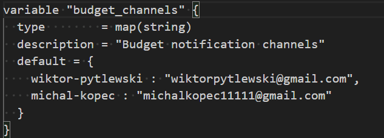
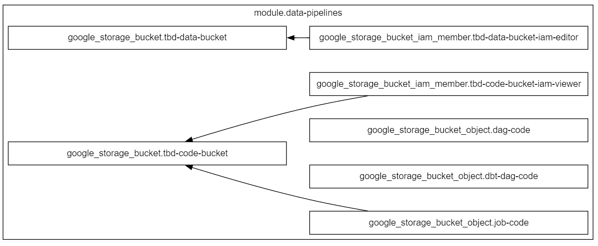
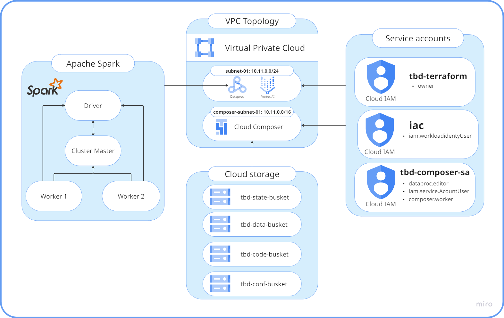
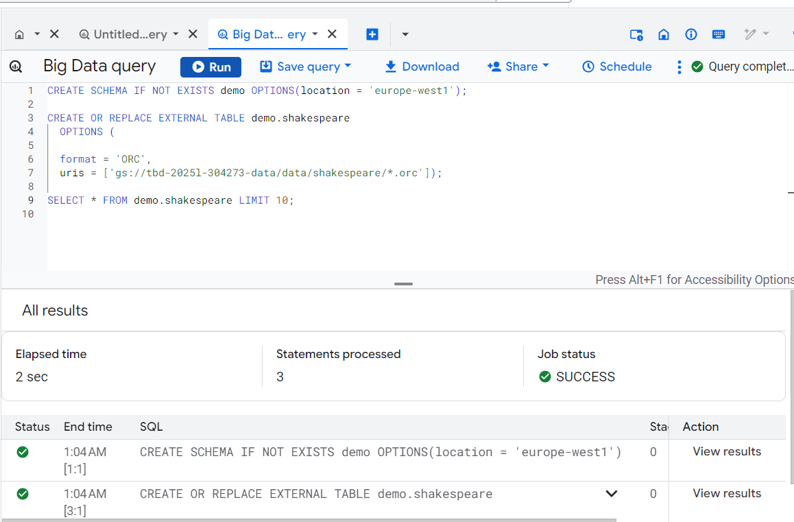
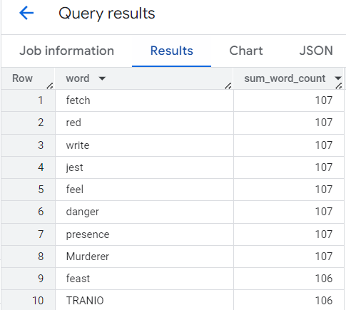
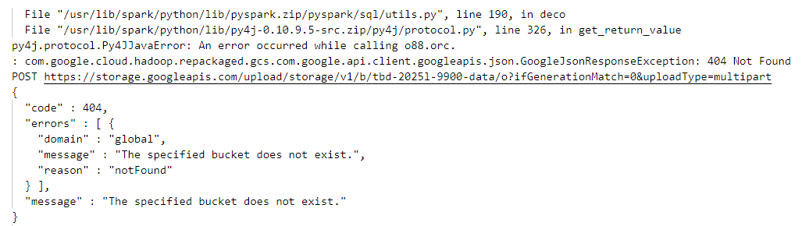

IMPORTANT ❗ ❗ ❗ Please remember to destroy all the resources after each work session. You can recreate infrastructure by creating new PR and merging it to master.


1. Authors:

   ***Group number: 16***
    - Michał Kopeć
    - Wiktor Pytlewski


   ***Link to forked repo: [https://github.com/Pytleniu/tbd-workshop-1](https://github.com/Pytleniu/tbd-workshop-1)***

2. Follow all steps in README.md.

3. In boostrap/variables.tf add your emails to variable "budget_channels".



4. From avaialble Github Actions select and run destroy on main branch.

5. Create new git branch and:
    1. Modify tasks-phase1.md file.

    2. Create PR from this branch to **YOUR** master and merge it to make new release.

    


6. Analyze terraform code. Play with terraform plan, terraform graph to investigate different modules.

After executing the command: `terraform plan -var-file="env\project.tfvars" -out="terraform_plan"`, a plan was generated for applying Terraform. The output shows the planned actions Terraform will perform, including which modules will be created, replaced, or updated. Additionally, the command provides details about which images and resources have been modified since the last application, as well as highlighting deprecated variables and resources.

By executing the command: `terraform graph -module-depth=1 > data-pipeline-graph.dot`, we generated a graph of the entire architecture and saved it into a file. Afterward, we isolated the part describing the Data Pipeline Module and created a diagram based on it.

**Data Pipeline Module** handles the creation and setup of Google Cloud Storage (GCS) buckets that are used to store scripts for a data pipeline powered by Apache Airflow. The module creates two separate buckets: one for storing the code for a Spark job (`tbd-code-bucket`), and another for storing pipeline data (`tbd-data-bucket`). Additionally, the module configures and sets up the necessary IAM to assign appropriate permissions to service accounts, along with creating a GCS bucket object for the code bucket.

The following diagram illustrates the relationships and dependencies between the resources created by this module:



**Resources:**
- `google_storage_bucket.tbd-code-bucket`: This GCS bucket stores the code related to the data pipeline, specifically for the Spark job.
- `google_storage_bucket.tbd-data-bucket`: A second GCS bucket that is used for storing the pipeline's data.
- `google_storage_bucket_iam_member.tbd-data-bucket-iam-editor`: This IAM resource grants the specified service account (`tbd-composer-sa`) the `storage.objectEditor` role on the `tbd-data-bucket`, allowing it to both read and write to the bucket.
- `google_storage_bucket_iam_member.tbd-code-bucket-iam-viewer`: This IAM resource grants the specified service account (`tbd-composer-sa`) the `storage.objectViewer` role on the `tbd-code-bucket`, providing it read-only access to the bucket.
- `google_storage_bucket_object.dag-code`: This resource stores a file in the `tbd-code-bucket` that contains the DAG code for Apache Airflow. The file will be used in the pipeline to define the workflow.
- `google_storage_bucket_object.dbt-dag-code`: This resource is similar to `dag-code` but stores a different file that contains the DBT (Data Build Tool) DAG code in the `tbd-code-bucket`.
- `google_storage_bucket_object.job-code`: This resource holds a Spark job script in the `tbd-code-bucket` that is used by the data pipeline during execution.

7. Reach YARN UI

The command that was used to set up the tunnel:
`gcloud compute ssh tbd-cluster-m --project=tbd-2025l-304273 --zone=europe-west1-d --tunnel-through-iap --ssh-flag="-L 8088:localhost:8088"`

With the tunnel open, YARN UI was accessible at port 8088: http://localhost:8088/cluster.


8. Draw an architecture diagram (e.g. in draw.io) that includes:
    1. VPC topology with service assignment to subnets
    2. Description of the components of service accounts

    - **tbd-terraform:** This account serves as the owner of the infrastructure and is used by Terraform to deploy and manage all cloud resources. With elevated privileges (`owner` role), it is capable of provisioning IAM policies, service accounts, network components, storage, and compute resources, ensuring infrastructure is consistent with the defined configuration.

    - **iac:** The `iac` service account is dedicated to Infrastructure as Code workflows. It has the `iam.workloadIdentityUser` role, enabling it to interact with GitHub Actions or other CI/CD pipelines using Workload Identity Federation. It bridges external systems (like GitHub) with Google Cloud, allowing automated and secure deployment processes.

    - **tbd-composer-sa:** This service account is responsible for managing and operating the Cloud Composer environment. It has roles such as `dataproc.editor`, `iam serviceAccountUser`, and `composer.worker`, which allow it to orchestrate workflows and interact with both Dataproc and other services within the VPC network. This account is essential for executing DAGs that trigger Spark jobs.

    3. List of buckets for disposal

    - **tbd-state-busket** - stores infrastructure state and metadata, such as Terraform state files.
    - **tbd-data-busket** - stores application data used as input or output during processing.
    - **tbd-code-busket** - stores executable scripts, application code, and Spark libraries.
    - **tbd-conf-busket** - stores configuration files and deployment-related scripts.

    4. Description of network communication (ports, why it is necessary to specify the host for the driver) of Apache Spark running from Vertex AI Workbech

    - **10.10.0.2** – Dataproc cluster component (e.g., Worker Node)

    - **10.10.0.3** – Another Dataproc cluster component (e.g., Worker Node)

    - **10.10.0.4** – Cluster Master Node

    - **10.10.0.5** – Vertex AI Workbench (Jupyter Notebook acting as the Driver)

    - **Driver Port: 30000** – Manages communication between the driver and other cluster components. It is responsible for task scheduling and job execution.

    - **Block Manager Port: 30001** – Facilitates the exchange of data blocks between Spark instances in the cluster, enabling efficient data transfer.

    - In Apache Spark deployments initiated from Vertex AI Workbench, the driver might run on a separate VM outside the Dataproc-managed cluster. In this setup, it is essential to explicitly specify the driver's host to ensure that all worker nodes and the master node can route communication to and from the driver correctly. This guarantees stable networking during distributed job execution and data exchange across the cluster.

    

9. Create a new PR and add costs by entering the expected consumption into Infracost
For all the resources of type: `google_artifact_registry`, `google_storage_bucket`, `google_service_networking_connection`
create a sample usage profiles and add it to the Infracost task in CI/CD pipeline. Usage file [example](https://github.com/infracost/infracost/blob/master/infracost-usage-example.yml)

To add the expected consumption costs for the specified resources, we created an infracost-usage.yml file in the root of our repository with the following configuration:

```yaml
version: 0.1
resource_usage:
  google_artifact_registry_repository:
    storage_gb: 128
    monthly_egress_data_transfer_gb:
      europe_west1: 16

  google_storage_bucket:
    storage_gb: 256
    monthly_class_a_operations: 4000
    monthly_class_b_operations: 8000
    monthly_data_retrieval_gb: 32
    monthly_egress_data_transfer_gb: 32

  google_service_networking_connection:
    monthly_egress_data_transfer_gb: 16
```

   

Infracost ran successfully for this pull request, and the result shows there was no increase in monthly cost estimates.

10. Create a BigQuery dataset and an external table using SQL

    The dataset and external table were created using the following SQL code:

    ```SQL
    CREATE SCHEMA IF NOT EXISTS demo OPTIONS(location = 'europe-west1');

    CREATE OR REPLACE EXTERNAL TABLE demo.shakespeare
    OPTIONS (
        format = 'ORC',
        uris = ['gs://tbd-2025l-304273-data/data/shakespeare/*.orc']);

    SELECT * FROM demo.shakespeare LIMIT 10;
    ```

    The query initially returned an error:

    

    Only after completing Task 11 (fixing the Spark job) did the query execute successfully:

    

    As a result, we obtained a newly created dataset and an external table that can now be queried:

    

    ***Why does ORC not require a table schema?***

    ORC files does not require a table schema, because they embed their schema information within the file itself, a separate table schema is unnecessary. This approach is sometimes referred to as “schema-on-read,” meaning the schema is determined when the data is read rather than at the time of writing. This provides greater flexibility and is especially useful in situations where data schemas change frequently

11. Find and correct the error in spark-job.py

    The issue in the `spark-job.py` script was caused by an incorrect value assigned to the `DATA_BUCKET` variable. The original bucket path referenced a non-existent bucket:

    ```python
    DATA_BUCKET = "gs://tbd-2025l-9900-data/data/shakespeare/"
    ```

    This resulted in a runtime error with HTTP status code `404 Not Found`, as shown in the Google Cloud logs:

    

    The error was identified by reviewing the logs generated during the execution of the Spark job. The full path to the bucket was found to be invalid.

    To resolve the issue, the bucket path was updated with the correct project identifier:

    ```python
    DATA_BUCKET = "gs://tbd-2025l-9900-data/data/shakespeare/"
    ```
    This change allowed the job to locate the ORC files correctly and proceed with successful data processing in step 10.

12. Add support for preemptible/spot instances in a Dataproc cluster

    Modifications were added to [`modules/dataproc/variables.tf`](modules/dataproc/variables.tf):

    ```hcl
    variable "worker_count" {
    type        = number
    default     = 2
    description = "Number of worker nodes"
    }
    ```

    And to the [`modules/dataproc/main.tf`](modules/dataproc/main.tf) file:

    ```hcl
    worker_config {
        num_instances = var.worker_count
        machine_type  = var.machine_type
        disk_config {
            boot_disk_type    = "pd-standard"
            boot_disk_size_gb = 100
        }
    }
    ```


